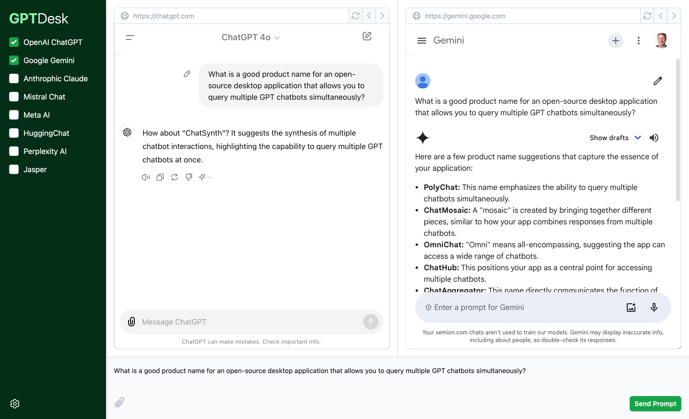

# GPTDesk

GPTDesk lets you query multiple GPT chatbots simultaneously. It's a work in progress and not yet ready for use.

Inspired by [GodMode](https://github.com/smol-ai/GodMode) and [Noi](https://github.com/lencx/Noi), but I wanted something up-to-date and better documented.

## Preview

## Todo

- [x] User interface design
- [x] Initial chatbot selection
- [ ] Load chatbots via config
- [ ] Create chatbot windows via new WebContentsView class
- [ ] Insert and submit queries